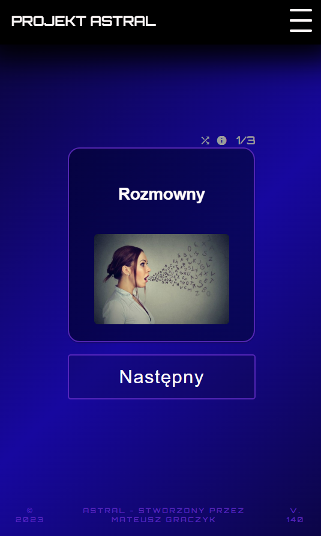
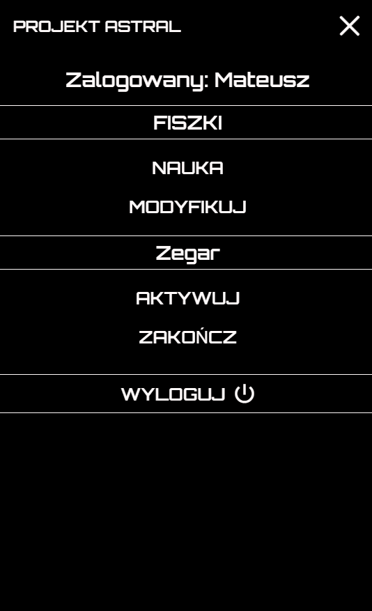
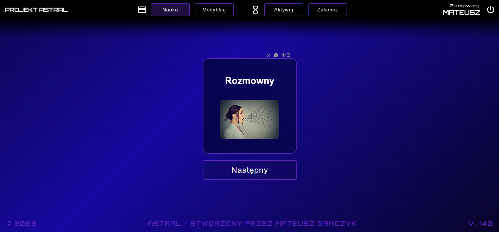
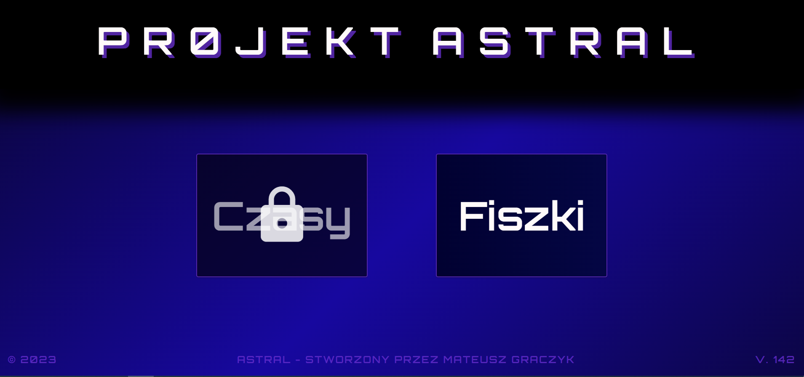

# Astral (Flashcards)

-------------

Hello everyone, today I want to show you my project Astral. 
It's simple flashcards web application that helps me to learn English.
It's really responsive application. 
You can add/modify/delete flashcards as you wish on mobile/desktop and import/export your flashcards.
Also, I added function for adding images (which are resized if needed) to get better score in remembering words.
Project has improvements such as a timer that counts down from 20 minutes to 0.
I had been working on him around a few months at my free time.
To be fair to You and me, it's not one of my best projects.
At that time I made big progress in Angular in my job,
but it's not shown in that project. 
In my mind I have better solutions for some problem now.
I wanted to try myself with CSS 7-1 architecture, and it was hard to
do by first time. Also, I had made mistake when I chose that CAPTCHA library.
I could not get styled it properly, but eventually it looks quite good.

-------------

You can see my work bellow:

Link: https://astral-flashcards.web.app

-------------

-------------

-------------

-------------

  
  

-------------

-------------

